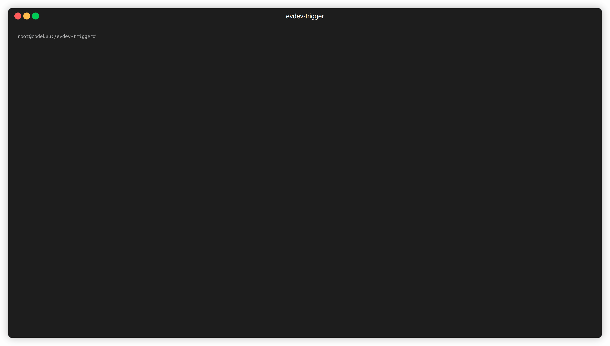

<center>
<h1>
    evdev-trigger
</h1>
Triggers "Actions" on input from evdev- devices. Select which devices to listen to and which actions to trigger based on the input.

[](https://pypi.org/project/evdev-trigger)
[](https://pypi.org/project/evdev-trigger)



</center>

**Table of Contents**

- [Installation](#installation)
- [Usage](#usage)
- [Create an action](#create-an-action)
- [License](#license)

## Installation

Recommended installation is via `pip` in a virtual environment:

```console
# Create a virtual environment
python3 -m venv venv

# Activate the virtual environment
source venv/bin/activate

# Install evdev-trigger
pip install evdev-trigger
```

## Usage

```console
$ evdev-trigger --help

 Usage: evdev-trigger [OPTIONS]

 Main function

╭─ Options ──────────────────────────────────────────────────────────────────────────────────────────────────────────────────────────────────────────────────────────╮
│ --file                                        TEXT  Storage file to use for storing reactions [default: storage.json]                                              │
│ --reset-storage         --no-reset-storage          Remove all devices and actions from storage (will not remove actions folder) [default: no-reset-storage]       │
│ --actions                                     TEXT  Folder to load actions from [default: None]                                                                    │
│ --install-completion                                Install completion for the current shell.                                                                      │
│ --show-completion                                   Show completion for the current shell, to copy it or customize the installation.                               │
│ --help                                              Show this message and exit.                                                                                    │
╰────────────────────────────────────────────────────────────────────────────────────────────────────────────────────────────────────────────────────────────────────╯
```

If you don't provide a storage file using `--file`, the default `storage.json` will be used in the current working directory.
If `--actions` is not provided, the default actions folder will be copied to the current working directory, if it doesn't already exist.

## Create an action

Examples of a standard action file and a complex action file can be found in the [default_actions folder](default_actions/).
A action is either a file that contains a class called Action which should use the base class `ActionBase` or a folder that contains a `__init__.py` file that contains the same class(es).

The evdev-trigger will call Action.execute with the input_device (Device class from evdev_trigger.models.devices) and the event (InputEvent from evdev.events).

Example of a simple action file:

```python
from evdev_trigger.models import BaseAction


class Action(BaseAction):
    action_name: str = "EXAMPLE_DEBUG_ACTIONS"
    action_description: str = "Prints the device name, event code and value"

    def execute(self, input_device, event):
        """Execute the action"""
        print(f"[EVENT] {input_device.input_device.name}: {event.code} - {event.value}")
```

## License

`evdev-trigger` is distributed under the terms of the [MIT](https://spdx.org/licenses/MIT.html) license.
